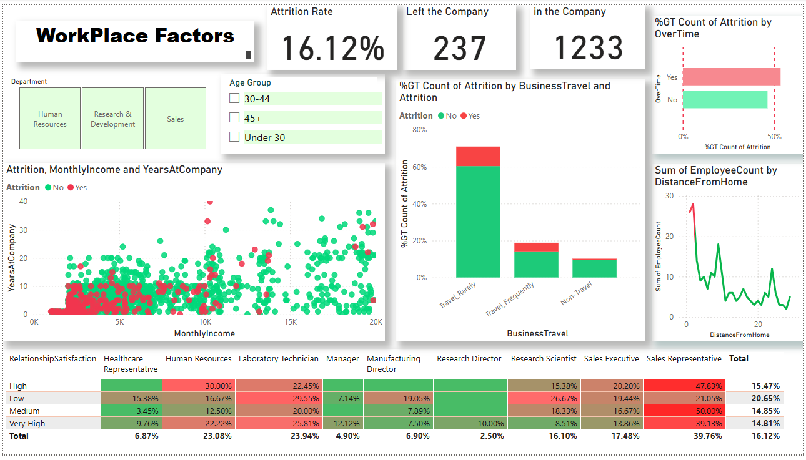
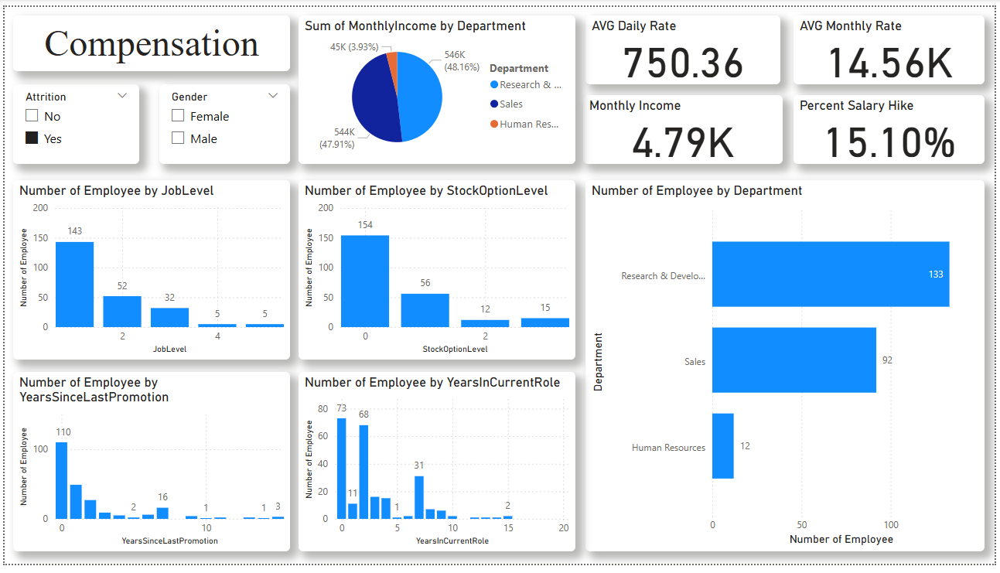
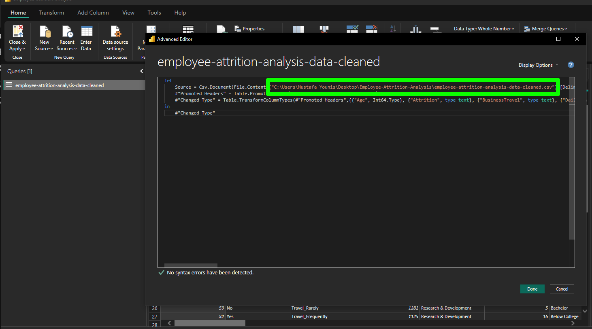

# Employee Attrition Analysis 📊
This project analyzes employee attrition using HR data to identify key factors that influence employee turnover. It was developed using Microsoft Power BI, DAX, and data modeling techniques to generate interactive dashboards and insights that help organizations improve retention and workforce planning.

---

<p align="center">
  <table>
    <tr>
      <td>
        
      </td>
    </tr>
    <tr>
      <td>
        
      </td>
    </tr>
  </table>
</p>

---

## Documentation📄
This project includes a detailed report that includes full explanations about project dashboards and insights :<br>
📄 [employee-attrition-analysis-report.pdf](employee-attrition-analysis-report.pdf)  

---


## Dashboards 📈
### 1. Overview Dashboard 🧭
Provides general insights about employees such as distribution by department, gender, age, and job satisfaction.

### 2. Workplace Factors Dashboard 🏢
Shows how work-related factors like overtime, business travel, income, and experience affect employee attrition.

### 3. Compensation with Attrition Dashboard 💰
Analyzes the relationship between salary, job level, and career growth with employee turnover.

---

## Project Structure 📁 
```
📁 Employee-Attrition-Analysis  
 ┣ 📄 employee-attrition-analysis.pbix          # Power BI dashboard file containing data model, visuals, and DAX measures
 ┣ 📄 employee-attrition-analysis-data.csv      # IBM HR Analytics dataset used for employee attrition analysis  
 ┣ 📄 employee-attrition-analysis-report.pdf    # Detailed project report with insights and explanations  
 ┣ 📄 README.md                                 # Project documentation and usage guide  
 ┗ 📁 screenshots                               # Images used in README (Dashboard preview images for README)
     ┣ 📸 hero-image1.png                       # Overview dashboard preview  
     ┣ 📸 hero-image2.png                       # Workplace factors dashboard preview  
     ┣ 📸 adding-data-path-example.png          # adding dataset path example in data source settings

```
## How to Use 🚀
1. Open the Power BI file
2. Explore the dashboards using filters and slicers
3. Analyze insights and trends

### Usage Note:
The Power BI file contains an internal copy of the dataset, so users can fully interact with the dashboards, apply filters, and explore the visuals without needing the original data file. However, any modification or direct refresh of the data requires the cleaned dataset (employee-attrition-analysis-data-cleaned.csv) to be available locally, and the file path must be updated in Power BI under Transform Data → Data source settings.
<p align="center">
  
</p>
---
